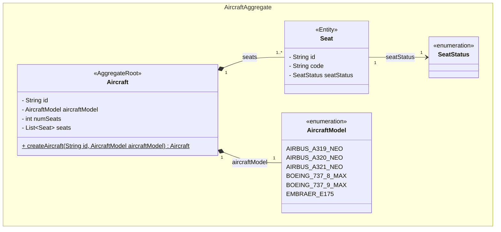

```mermaid
classDiagram
direction TB
namespace AircraftAggregate {
class Aircraft {
<<AggregateRoot>>
- String id
- AircraftModel aircraftModel
- int numSeats
- List~Seat~ seats
+ createAircraft(String id, AircraftModel aircraftModel) Aircraft$
}

    class Seat {
        <<Entity>>
        - String id
        - String code
        - SeatStatus seatStatus
    }

    class SeatStatus {
        <<enumeration>>
    }

    class AircraftModel {
        <<enumeration>>
        AIRBUS_A319_NEO
        AIRBUS_A320_NEO
        AIRBUS_A321_NEO
        BOEING_737_8_MAX
        BOEING_737_9_MAX
        EMBRAER_E175
    }
}

Aircraft "1" *-- "1..*" Seat : seats
Aircraft "1" *-- "1" AircraftModel : aircraftModel
Seat "1" --> "1" SeatStatus : seatStatus
```