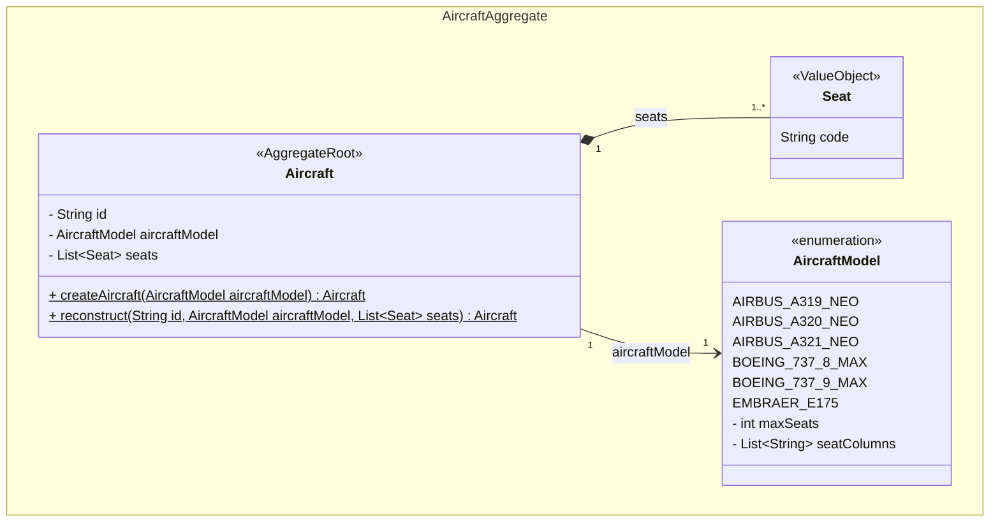

```mermaid
classDiagram
direction TB
namespace AircraftAggregate {
    class Aircraft {
        <<AggregateRoot>>
        - String id
        - AircraftModel aircraftModel
        - List~Seat~ seats
        + createAircraft(AircraftModel aircraftModel) Aircraft$
        + reconstruct(String id, AircraftModel aircraftModel, List~Seat~ seats) Aircraft$
    }

    class Seat {
        <<ValueObject>>
        String code
    }

    class AircraftModel {
        <<enumeration>>
        AIRBUS_A319_NEO
        AIRBUS_A320_NEO
        AIRBUS_A321_NEO
        BOEING_737_8_MAX
        BOEING_737_9_MAX
        EMBRAER_E175
        - int maxSeats
        - List~String~ seatColumns
    }
}

Aircraft "1" *-- "1..*" Seat : seats
Aircraft "1" --> "1" AircraftModel : aircraftModel
```

A `Seat` is only a code (`1A`, `1B`, …). Its status per leg lives in `LegSeat`, inside the Leg aggregate.
