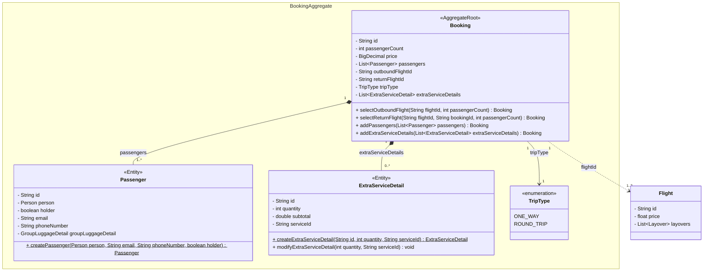

```mermaid
classDiagram
direction TB

namespace BookingAggregate {
class Booking {
<<AggregateRoot>>
- String id
- int passengerCount
- BigDecimal price
- List~Passenger~ passengers
- String outboundFlightId
- String returnFlightId
- TripType tripType
- List~ExtraServiceDetail~ extraServiceDetails
+ selectOutboundFlight(String flightId, int passengerCount) Booking
+ selectReturnFlight(String flightId, String bookingId, int passengerCount) Booking
+ addPassengers(List~Passenger~ passengers) Booking
+ addExtraServiceDetails(List~ExtraServiceDetail~ extraServiceDetails) Booking
}

    class Passenger {
        <<Entity>>
        - String id
        - Person person
        - boolean holder
        - String email
        - String phoneNumber
        - GroupLuggageDetail groupLuggageDetail
        + createPassenger(Person person, String email, String phoneNumber, boolean holder) Passenger$
    }

    class ExtraServiceDetail {
        <<Entity>>
        - String id
        - int quantity
        - double subtotal
        - String serviceId
        + createExtraServiceDetail(String id, int quantity, String serviceId) ExtraServiceDetail$
        + modifyExtraServiceDetail(int quantity, String serviceId) void
    }

    class TripType {
        <<enumeration>>
        ONE_WAY
        ROUND_TRIP
    }
}

class Flight {
- String id
- float price
- List~Layover~ layovers
}

Booking "1" *-- "1..*" Passenger : passengers
Booking "1" *-- "0..*" ExtraServiceDetail : extraServiceDetails
Booking "1" --> "1" TripType : tripType
Booking "1" ..> "1..2" Flight : flightId
```