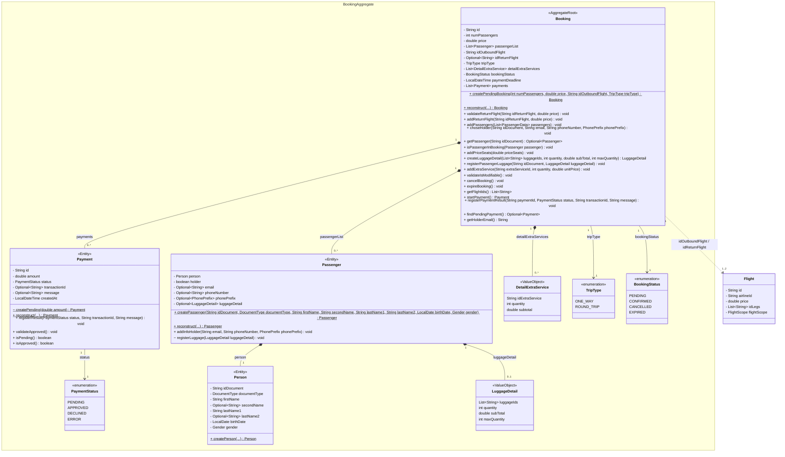

```mermaid
classDiagram
direction TB

namespace BookingAggregate {
    class Booking {
        <<AggregateRoot>>
        - String id
        - int numPassengers
        - double price
        - List~Passenger~ passengerList
        - String idOutboundFlight
        - Optional~String~ idReturnFlight
        - TripType tripType
        - List~DetailExtraService~ detailExtraServices
        - BookingStatus bookingStatus
        - LocalDateTime paymentDeadline
        - List~Payment~ payments
        + createPendingBooking(int numPassengers, double price, String idOutboundFlight, TripType tripType) Booking$
        + reconstruct(...) Booking$
        + validateReturnFlight(String idReturnFlight, double price) void
        + addReturnFlight(String idReturnFlight, double price) void
        + addPassengers(List~PassengerData~ passengers) void
        + choseHolder(String idDocument, String email, String phoneNumber, PhonePrefix phonePrefix) void
        + getPassenger(String idDocument) Optional~Passenger~
        + isPassengerInBooking(Passenger passenger) void
        + addPriceSeats(double priceSeats) void
        + createLuggageDetail(List~String~ luggageIds, int quantity, double subTotal, int maxQuantity) LuggageDetail
        + registerPassengerLuggage(String idDocument, LuggageDetail luggageDetail) void
        + addExtraService(String extraServiceId, int quantity, double unitPrice) void
        + validateIsModifiable() void
        + cancelBooking() void
        + expireBooking() void
        + getFlightIds() List~String~
        + startPayment() Payment
        + registerPaymentResult(String paymentId, PaymentStatus status, String transactionId, String message) void
        + findPendingPayment() Optional~Payment~
        + getHolderEmail() String
    }

    class Payment {
        <<Entity>>
        - String id
        - double amount
        - PaymentStatus status
        - Optional~String~ transactionId
        - Optional~String~ message
        - LocalDateTime createdAt
        ~ createPending(double amount) Payment$
        + reconstruct(...) Payment$
        + registerResult(PaymentStatus status, String transactionId, String message) void
        + validateApproved() void
        + isPending() boolean
        + isApproved() boolean
    }

    class PaymentStatus {
        <<enumeration>>
        PENDING
        APPROVED
        DECLINED
        ERROR
    }

    class Passenger {
        <<Entity>>
        - Person person
        - boolean holder
        - Optional~String~ email
        - Optional~String~ phoneNumber
        - Optional~PhonePrefix~ phonePrefix
        - Optional~LuggageDetail~ luggageDetail
        + createPassenger(String idDocument, DocumentType documentType, String firstName, String secondName, String lastName1, String lastName2, LocalDate birthDate, Gender gender) Passenger$
        + reconstruct(...) Passenger$
        + addInfoHolder(String email, String phoneNumber, PhonePrefix phonePrefix) void
        ~ registerLuggage(LuggageDetail luggageDetail) void
    }

    class Person {
        <<Entity>>
        - String idDocument
        - DocumentType documentType
        - String firstName
        - Optional~String~ secondName
        - String lastName1
        - Optional~String~ lastName2
        - LocalDate birthDate
        - Gender gender
        + createPerson(...) Person$
    }

    class LuggageDetail {
        <<ValueObject>>
        List~String~ luggageIds
        int quantity
        double subTotal
        int maxQuantity
    }

    class DetailExtraService {
        <<ValueObject>>
        String idExtraService
        int quantity
        double subtotal
    }

    class TripType {
        <<enumeration>>
        ONE_WAY
        ROUND_TRIP
    }

    class BookingStatus {
        <<enumeration>>
        PENDING
        CONFIRMED
        CANCELLED
        EXPIRED
    }
}

class Flight {
    - String id
    - String airlineId
    - double price
    - List~String~ idLegs
    - FlightScope flightScope
}

Booking "1" *-- "0..*" Passenger : passengerList
Passenger "1" *-- "1" Person : person
Passenger "1" *-- "0..1" LuggageDetail : luggageDetail
Booking "1" *-- "0..*" DetailExtraService : detailExtraServices
Booking "1" --> "1" TripType : tripType
Booking "1" --> "1" BookingStatus : bookingStatus
Booking "1" *-- "0..*" Payment : payments
Payment "1" --> "1" PaymentStatus : status
Booking "1" ..> "1..2" Flight : idOutboundFlight / idReturnFlight
```
