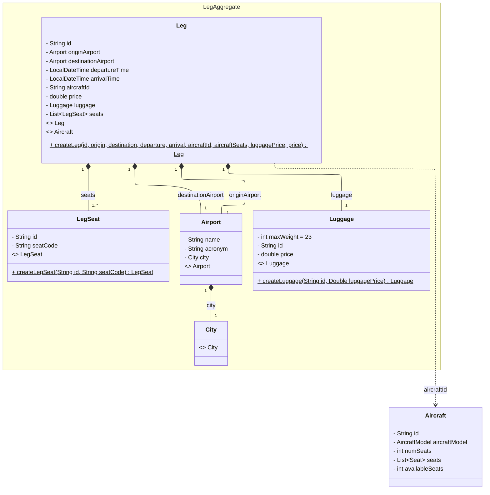

```mermaid
---
config:
  layout: elk
---
classDiagram
direction TB
    namespace LegAggregate {
        class Leg {
            - String id
            - Airport originAirport
            - Airport destinationAirport
            - LocalDateTime departureTime
            - LocalDateTime arrivalTime
            - String aircraftId
            - double price
            - Luggage luggage
            - List~LegSeat~ seats
            + createLeg(id, origin, destination, departure, arrival, aircraftId, aircraftSeats, luggagePrice, price) Leg$
        }

        class LegSeat {
            - String id
            - String seatCode
            + createLegSeat(String id, String seatCode) LegSeat$
        }

        class Luggage {
            - int maxWeight = 23
            - String id
            - double price
            + createLuggage(String id, Double luggagePrice) Luggage$
        }

        class Airport {
            - String name
            - String acronym
            - City city
        }

        class City {
        }

    }
    class Aircraft {
            - String id
            - AircraftModel aircraftModel
            - int numSeats
            - List~Seat~ seats
            - int availableSeats
    }

    class Luggage

    Leg :<<AggregateRoot>> Leg
    LegSeat :<<Entity>> LegSeat
    Luggage :<<Entity>> Luggage
    Airport :<<ValueObject>> Airport
    City :<<ValueObject>> City
    Leg :<<Entity - Airline>> Aircraft

    Leg "1" *-- "1" Luggage : luggage
    Leg "1" *-- "1..*" LegSeat : seats
    Leg "1" *-- "1" Airport : originAirport
    Leg "1" *-- "1" Airport : destinationAirport
    Airport "1" *-- "1" City : city
    Leg ..> Aircraft : aircraftId
```