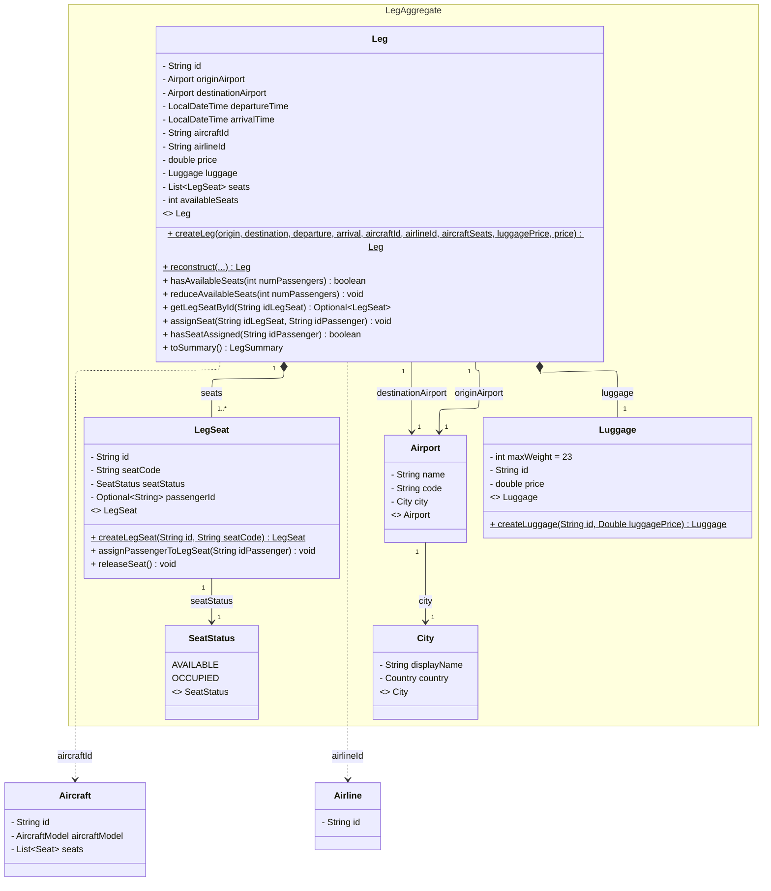

```mermaid
---
config:
  layout: elk
---
classDiagram
direction TB
    namespace LegAggregate {
        class Leg {
            - String id
            - Airport originAirport
            - Airport destinationAirport
            - LocalDateTime departureTime
            - LocalDateTime arrivalTime
            - String aircraftId
            - String airlineId
            - double price
            - Luggage luggage
            - List~LegSeat~ seats
            - int availableSeats
            + createLeg(origin, destination, departure, arrival, aircraftId, airlineId, aircraftSeats, luggagePrice, price) Leg$
            + reconstruct(...) Leg$
            + hasAvailableSeats(int numPassengers) boolean
            + reduceAvailableSeats(int numPassengers) void
            + getLegSeatById(String idLegSeat) Optional~LegSeat~
            + assignSeat(String idLegSeat, String idPassenger) void
            + hasSeatAssigned(String idPassenger) boolean
            + toSummary() LegSummary
        }

        class LegSeat {
            - String id
            - String seatCode
            - SeatStatus seatStatus
            - Optional~String~ passengerId
            + createLegSeat(String id, String seatCode) LegSeat$
            + assignPassengerToLegSeat(String idPassenger) void
            + releaseSeat() void
        }

        class SeatStatus {
            AVAILABLE
            OCCUPIED
        }

        class Luggage {
            - int maxWeight = 23
            - String id
            - double price
            + createLuggage(String id, Double luggagePrice) Luggage$
        }

        class Airport {
            - String name
            - String code
            - City city
        }

        class City {
            - String displayName
            - Country country
        }
    }

    class Aircraft {
        - String id
        - AircraftModel aircraftModel
        - List~Seat~ seats
    }

    class Airline {
        - String id
    }

    Leg :<<AggregateRoot>> Leg
    LegSeat :<<Entity>> LegSeat
    SeatStatus :<<enumeration>> SeatStatus
    Luggage :<<Entity>> Luggage
    Airport :<<enumeration>> Airport
    City :<<enumeration>> City

    Leg "1" *-- "1" Luggage : luggage
    Leg "1" *-- "1..*" LegSeat : seats
    LegSeat "1" --> "1" SeatStatus : seatStatus
    Leg "1" --> "1" Airport : originAirport
    Leg "1" --> "1" Airport : destinationAirport
    Airport "1" --> "1" City : city
    Leg ..> Aircraft : aircraftId
    Leg ..> Airline : airlineId
```

`LegSeat.passengerId` holds the passenger's document. `availableSeats` is reduced when a flight is selected, before any `LegSeat` is assigned.
